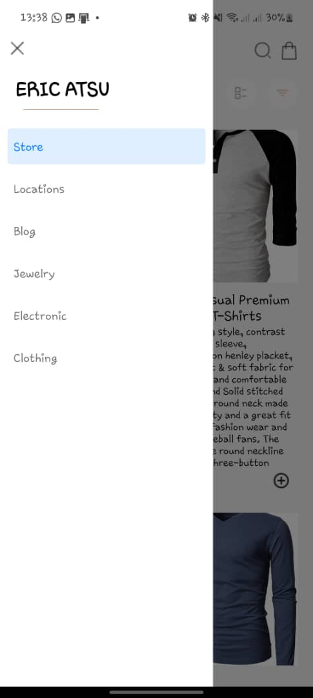

# rn-assignment7-11252890

## Features

1. HomeScreen: Displays a list of available products fetched from an external API.
2. ProductDetailScreen: Shows detailed information about each product.
3. CartScreen: Allows users to view selected items in their cart and manage them.
4. Drawer Navigation: Provides easy access to different screens via swipe gesture or button.
5. Add to Cart: Allows users to add products to their shopping cart.
6. Remove from Cart: Enables users to remove items from their cart.
7. Local Storage: Uses AsyncStorage to store selected items locally on the device.

## Screenshots

## Author

Jayden John Boamah Osafo - 11252890